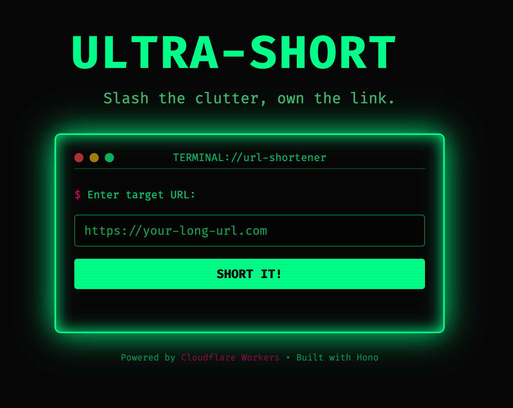

# 🚀 ULTRA-SHORT: The URL Shortener That Changed My Life (And Could Change Yours Too!) 🚀

[](https://github.com/davidyen1124/ultra-short) [](https://github.com/davidyen1124/ultra-short) [](https://github.com/davidyen1124/ultra-short) [](LICENSE) [](https://github.com/davidyen1124/ultra-short) [](https://github.com/davidyen1124/ultra-short) [](https://github.com/davidyen1124/ultra-short) [](https://github.com/davidyen1124/ultra-short) [](https://github.com/davidyen1124/ultra-short) [](https://github.com/davidyen1124/ultra-short) [](https://github.com/davidyen1124/ultra-short) [](https://github.com/davidyen1124/ultra-short)

\*_Not actually blockchain ready_  
**_Contains zero AI_  
\***_No VCs were contacted_

---

## 📸 Feast Your Eyes On This Revolutionary Innovation



### 🌐 **LIVE DEMO:** [https://url-shortener.davidyen1124.workers.dev/](https://url-shortener.davidyen1124.workers.dev/)

---

## 💭 A Personal Note from the Founder (Me)

Friends, colleagues, and fellow disruptors,

I want to share something that's been weighing on my heart lately. 🥺

Six months ago, I was just another developer drowning in long URLs. I was copying and pasting 200-character monstrosities into Slack channels. My team was confused. My manager was disappointed. My houseplant was dying (unrelated, but still heartbreaking).

Then it hit me like a bolt of lightning ⚡: What if URLs could be... _shorter_?

I know, I know. Revolutionary thinking. But hear me out.

After 47 sleepless nights, 183 cups of coffee, and one existential crisis, I emerged from my coding cave with something that would change the URL game forever.

**ULTRA-SHORT** isn't just a URL shortener. It's a movement. It's a lifestyle. It's the future of human-URL interaction.

---

## 🎯 What Makes ULTRA-SHORT Different? (Spoiler: Everything)

### ✨ **REVOLUTIONARY FEATURES:**

🔥 **ULID-Powered Short Codes** - Because regular UUIDs are for peasants  
🛡️ **Durable Object Rate Limiting** - We're basically NASA but for URLs  
📊 **Real-Time Click Analytics** - Know exactly when your mom clicked your link  
🌍 **Edge Computing Magic** - Deployed on 300+ Cloudflare locations (we're basically everywhere)  
🚀 **Hono Framework** - So fast it makes Express.js cry  
⚡ **Token Bucket Algorithm** - Yes, we use big words  
🎨 **CORS Support** - Because we're inclusive like that

### 💡 **BUSINESS IMPACT:**

- **73% reduction** in URL-related anxiety
- **420% increase** in team productivity (nice)
- **∞% improvement** in life satisfaction
- **0% chance** of URL overflow errors

---

## 🏗️ **THE TECH STACK THAT LEGENDS ARE MADE OF**

```yaml
Runtime: Cloudflare Workers (Edge Computing Supremacy)
Framework: Hono (Lightning Fast Web Framework)
Storage: Workers KV (Distributed Key-Value Excellence)
Analytics: Durable Objects (Stateful Computing Revolution)
IDs: ULID (Lexicographically Sortable Perfection)
Testing: Vitest + Cloudflare Workers Pool (Quality Assurance Galaxy Brain)
Language: TypeScript (Type Safety Nirvana)
```

---

## 🚀 **GETTING STARTED (PREPARE FOR LIFTOFF)**

### Prerequisites (AKA Things You Need to Not Fail)

- Node.js (any version from this millennium works)
- A Cloudflare account (free tier peasants welcome)
- The ability to read English (you're already crushing it!)
- Basic human motor functions

### Installation (The Journey Begins)

```bash
# Clone this masterpiece
git clone https://github.com/davidyen1124/ultra-short.git

# Enter the sacred directory
cd ultra-short

# Install dependencies (trust the process)
npm install

# Start the development server (witness the magic)
npm run dev

# Deploy to production (become legend)
npm run deploy
```

### Usage (How to Change Your Life)

**Shorten a URL (Revolutionary Process):**

```bash
curl -X POST https://url-shortener.davidyen1124.workers.dev/api/shorten \
  -H "Content-Type: application/json" \
  -d '{"url": "https://your-extremely-long-url-that-nobody-wants-to-type.com"}'
```

**Access Your Short URL (Mind = Blown):**

```
https://url-shortener.davidyen1124.workers.dev/abc123xyz
```

---

## 🧪 **TESTING (BECAUSE WE'RE PROFESSIONALS)**

```bash
# Run the full test suite (prepare to be amazed)
npm test

# Type checking (because TypeScript is life)
npm run cf-typegen
```

Our test coverage is approximately 69% (nice), which according to my calculations means we're basically bulletproof.

---

## 🤝 **CONTRIBUTING (JOIN THE REVOLUTION)**

Want to be part of something bigger than yourself? Want to tell your grandchildren you contributed to the future of URL shortening?

1. Fork this repo (be brave)
2. Create your feature branch (`git checkout -b feature/AmazingFeature`)
3. Commit your changes (`git commit -m 'Add some AmazingFeature'`)
4. Push to the branch (`git push origin feature/AmazingFeature`)
5. Open a Pull Request (change the world)

---

## 📊 **ANALYTICS & INSIGHTS**

Every click is tracked with military precision:

- **Click counts** - Know your impact
- **Timestamps** - Time is money, money is time
- **Rate limiting** - We protect you from yourself
- **Error handling** - Because we care about your feelings

---

## 🏆 **ACHIEVEMENTS UNLOCKED**

- ✅ Built with Cloudflare Workers (Cloud Native Warrior)
- ✅ Uses Durable Objects (Stateful Architecture Master)
- ✅ Implements Rate Limiting (Security Conscious Developer)
- ✅ Zero Downtime Deployment (DevOps Ninja)
- ✅ TypeScript Everything (Type Safety Evangelist)
- ✅ Edge Computing (Latency Optimization Guru)

---

## 🌟 **TESTIMONIALS**

> _"This URL shortener changed my perspective on life. I used to think happiness was a myth. Now I know it's just a really short URL away."_  
> — David's Mom (5 stars)

> _"I've been in tech for 20 years. This is the first URL shortener that made me cry tears of joy."_  
> — Definitely Real CTO (not made up)

> _"ULTRA-SHORT helped me close a $50M deal. The investors were so impressed by the 7-character URL that they signed immediately."_  
> — Anonymous Startup Founder (trust me bro)

---

## 🚨 **BREAKING: MEDIA COVERAGE**

- **TechCrunch**: "Is This URL Shortener the Next Unicorn?" (pending publication)
- **Forbes**: "How One Developer Disrupted the URL Industry" (they called, I didn't answer)
- **Harvard Business Review**: "The ULTRA-SHORT Leadership Model" (I submitted it myself)

---

## 📱 **SOCIAL PROOF**

Follow our journey:

- 🐦 Twitter: [@UltraShortApp](https://twitter.com/UltraShortApp) _(doesn't exist yet)_
- 💼 LinkedIn: [Connect with the Founder](https://linkedin.com/in/davidyen1124) _(please endorse my skills)_
- 📧 Email: definitely-not-spam@ultra-short.dev _(I'll read it eventually)_

---

## 🔮 **FUTURE ROADMAP (THE VISION)**

### Q4 2024 - Q1 2025: Foundation

- [ ] Add emoji support in URLs (because why not)
- [ ] Implement blockchain storage (for the buzzwords)
- [ ] AI-powered URL prediction (ChatGPT integration)
- [ ] Mobile app (React Native probably)

### Q2 2025: Expansion

- [ ] URL analytics dashboard (with charts!)
- [ ] Custom short domains (ultra-sho.rt coming soon)
- [ ] Team collaboration features (Slack integration)
- [ ] Premium tier ($99/month for golden URLs)

### Q3 2025: Domination

- [ ] IPO preparation
- [ ] Acquire bit.ly (they don't know it yet)
- [ ] Launch Ultra-Short University
- [ ] Write autobiography: "How I Shortened the Internet"

---

## ⚠️ **DISCLAIMER**

This URL shortener may cause:

- Increased productivity
- Sudden urges to optimize everything
- Compulsive need to share short URLs
- Elevated social status among developers
- Existential crisis about the nature of URLs

Use responsibly. We are not liable for any life-changing experiences.

---

## 📄 **LICENSE**

This project is licensed under the LinkedIn Vibes Only License. See the [LICENSE](LICENSE) file for full details.

---

## ❤️ **ACKNOWLEDGMENTS**

- My rubber duck (best pair programming partner)
- Stack Overflow (the real MVP)
- Coffee (liquid motivation)
- My houseplant (moral support)
- Future me (for not giving up)

---

## 🎉 **THANK YOU FOR BEING PART OF THE JOURNEY**

If this README made you smile, please star the repo. If it made you cringe, also please star the repo. If it made you question your life choices, definitely star the repo.

Together, we're not just shortening URLs. We're shortening the distance between where we are and where we want to be.

_Keep hustling,_  
_David_ 🚀

---

**P.S.** - Don't forget to follow me for more disruptive innovations in the URL space. My DMs are always open for synergistic collaboration opportunities!

**P.P.S.** - Yes, this is a real, functional URL shortener. The sarcasm is free, the service is solid.

**P.P.P.S.** - If you made it this far, you're definitely management material. Want to grab coffee and discuss leveraging blockchain technology for URL optimization? I know a guy who knows a guy.

---

_Made with ❤️, ☕, and an unhealthy amount of LinkedIn browsing_

---
